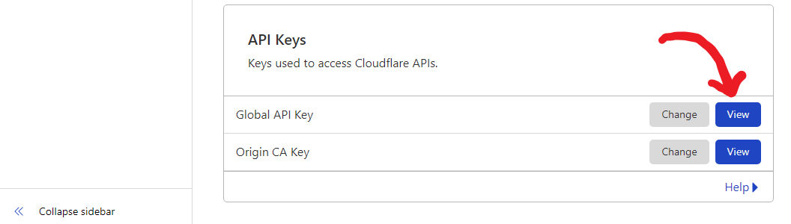
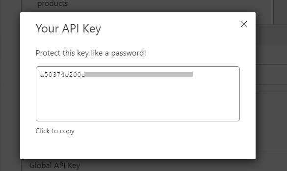
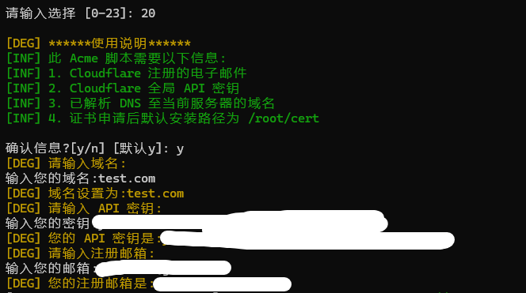

This project is based on the upstream X-UI project to make minor functional changes! The follow-up will be closely followed by the upstream X-UI version update! Thanks to [vaxilu] (https://github.com/vaxilu/x-ui ) And everyone to contribute to this project

----------------------------------------------------------------------------------------------------------------------------------------------
### Function introduction

System status monitoring
Support multi-protocol, web page visualization operation
Supported protocols: vmess, vless, trojan, shadowsocks, dokodemo-door, socks, http
Support configuration of more transmission configurations
Traffic statistics, limit traffic, limit expiration time
Customizable xray configuration template
Support https access panel (bring your own domain name + ssl certificate)
For more advanced configuration items, see the panel for details

----------------------------------------------------------------------------------------------------------------------------------------------

The display function of this script is more user-friendly!Various installation failures of new and old systems have been resolved, and will be updated for a long time. Everyone is welcome to make suggestions!！

### VPS security reinforcement recommendations

<details>
  <summary> Click to view VPS security reinforcement recommendations </summary>

1. Keep the kernel version updated and fix kernel-level vulnerabilities

2. Turn on the firewall and don't run naked

3. Install Fail2ban and configure ssh nginx to automatically block suspicious IP addresses

4. Do not use a simple password, or prohibit the use of a password to log in, use the RSA private key to log in

5. Configure the number of ssh password retries

6. Add the specified IP to log in to ssh, delete the firewall and release the ssh service. If you don't have a fixed IP, use clash or other ssh that can be proxied to let you connect to your vps ip.

clash rules`-DST-PORT, 22, ACCESS-DENIED`

firewall settings

Install firewall on Ubuntu/debain

```bash
#1. Turn off the default ufw
# Stop ufw service
sudo systemctl stop ufw
# Turn off and start
sudo systemctl disable ufw
# Delete ufw rule
sudo ufw --force reset
#2 Install firewall
apt update 
apt install -y firewalld
#Overload (after increasing or decreasing the rules, it needs to be overloaded)
firewall-cmd --reload
#Start
systemctl start firewalld
#Restart
systemctl restart firewalld
#Set the boot to start
systemctl enable firewalld
#Turn off and start
systemctl disable firewalld
```

centos/Rocky/Redhat install firewall

```bash
yum install -y firewalld
#Overload (after increasing or decreasing the rules, it needs to be overloaded)
firewall-cmd --reload
#Start
systemctl start firewalld
#Restart
systemctl restart firewalld
#Set the boot to start
systemctl enable firewalld
#Turn off and start
systemctl disable firewalld
```

```bash
# Add the specified ip to access the ssh service
firewall-cmd --permanent --add-rich-rule='rule family=ipv4 source address=10.0.0.1/32 service name=ssh accept'
firewall-cmd --permanent --add-rich-rule='rule family="ipv4" source address="103.119.132.41/32" service name="ssh" accept'
# Turn off all ssh ip access services
firewall-cmd --remove-service=ssh --permanent
# Add http https service
firewall-cmd --add-service=http --permanent
firewall-cmd --add-service=https --permanent
# Effective configuration
firewall-cmd --reload
# View rules
firewall-cmd --list-all
```
</details>

----------------------------------------------------------------------------------------------------------------------------------------------
Update log：

2023.8.8 Update to the latest dependency, add fragment to control the TCP shards issued, and in some cases it can deceive the review system, such as bypassing the SNI blacklist.[Client configuration module reference] (./media/xray.json) [Official configuration document] (https://xtls.github.io/config/outbounds/freedom.html#outboundconfigurationobject )

2023.5.29 Add xray-ui crontab command, add geoip update to the scheduled task, execute at 1.30am by default, you can modify the/etc/crontab file

2023.5.15 Add xray-ui geoip update IP library add database import and export

2023.5.6 Fixed the configuration of cipherSuites, multi-selection, and changed the split symbol from, to: Because I didn't read the document, I added it as usual.Sorry, if you configured cipherSuites at the beginning, please change it to auto and then upgrade and add the network card interface to be visible.

2023.5.4 Sniffing multiple choices, tls cipherSuites configuration multiple choices!

2023.4.28 Add REALITY to share and randomly select sni to facilitate the use of any_SNI_No_SNI configuration scheme

2023.4.26 [Add Nginx pre-SNI shunt] (./Nginx前置SNI分流.md )

2023.4.24 Add one-click update geoip, geosite add geoip, geosite update version number

2023.4.23 Add docker image

### SSL certificate

<details>
  <summary> Click to view SSL certificate details </summary>

### ACME
Use ACME to manage SSL certificates：

1. Make sure your domain name resolves to the server correctly.
2. Run the "xray-ui" command in the terminal, and then select "SSL certificate management".
3. You will see the following options：

   -**Get SSL:** Get an SSL certificate.
   -** Revocation of certificate:** Revocation of existing SSL certificate.
   -**Mandatory renewal:** Mandatory renewal of SSL certificate.

### Certbot

Install and use Certbot：

```bash
apt-get install certbot -y
certbot certonly --standalone --agree-tos --register-unsafely-without-email -d yourdomain.com
certbot renew --dry-run
```

### Cloudflare

The management script has built-in Cloudflare's SSL certificate request.To use this script to apply for a certificate, you need the following information：

-Cloudflare registered email
-Cloudflare global API key
-The domain name must be resolved to the current server through Cloudflare

**How to obtain the Cloudflare global API key：**

1. Run the'xray-ui` command in the terminal, and then select 'Cloudflare SSL Certificate`.
2. Access link: [Cloudflare API Tokens] (https://dash.cloudflare.com/profile/api-tokens ).
3. Click "View Global API Key” (see picture below)：
   
4. You may need to re-verify your account.The API key will be displayed later (see figure below)：
   

When using it, just enter your 'domain name`, 'email' and 'API key'.As shown in the figure below：


### xray-ui configure ssl certificate
```bash
xray-ui option 22
Enter the certificate path and key path
Manually configure the certificate
/usr/local/xray-ui/xray-ui cert-webCert/root/cert/your domain name/full chain.pem-webCertKey /root/cert/your domain name/privkey.pem
Clean up the certificate and enter directly without entering anything
Restart xray-ui
xray-ui option 10

```
### xray-ui configuration mTLS
```bash
xray-ui option 23
Enter the certificate path and the key path, the CA path
Manually configure the certificate
/usr/local/xray-ui/xray-ui cert-webCert/root/cert/your domain name/full chain.pem-webCertKey /root/cert/your domain name/privkey.pem -webCa /root/cert/ca.cer
Clean up the certificate and enter directly without entering anything
Restart xray-ui
xray-ui option 10
```
</details>

### docker run
<details>
  <summary> Click to view the operation of docker </summary>

```bash
#juestnow/xray-ui:latest latest version specify the version number #pull juestnow/xray-ui: 1.8.6
 docker run -d --net=host -v/etc/xray-ui:/etc/xray-ui  -v/root/cert:/root/cert --restart=unless-stopped --name xray-ui juestnow/xray-ui:latest
# View default account password
Container name started by docker exec-ti /app/xray-ui setting-show
docker exec -ti xray-ui  /app/xray-ui setting -show
# Set account password
Container name started by docker exec-ti /app/xray-ui setting-password abcd-username abacd 
docker exec -ti xray-ui  /app/xray-ui setting -password abcd -username abacd
# Set path 
Container name started by docker exec-ti /app/xray-ui setting--webBasePath aaaaddffdf
docker exec -ti xray-ui  /app/xray-ui setting --webBasePath aaaaddffdf
# Certificate configuration 
## TLS configuration
docker exec-ti xray-ui /app/xray-ui cert-webCert/root/cert/your domain name /full chain.pem-webCertKey /root/cert/your domain name/privkey.pem
## mTLS configuration
docker exec-ti xray-ui /app/xray-ui cert-webCert/root/cert/your domain name /full chain.pem-webCertKey /root/cert/your domain name/privkey.pem -webCa /root/cert/ca.cer
# First visit
The current panel http only supports 127.0.0.1 access. If you access it from outside, please use ssh forwarding or nginx proxy or xray-ui to configure the certificate. Select 22 to configure the certificate.
ssh forwarding client operation ssh-f-N-L 127.0.0.1:22222 (ssh proxy port unused port):127.0.0.1:54321 (xray-ui port) root@8.8.8.8 (xray-ui server ip)
Browser access http://127.0.0.1:22222 (ssh proxy port unused port)/path (web access path)
```
</details>

### First visit

<details>
  <summary>Click to view manual installation </summary>

```bash
The current panel http only supports 127.0.0.1 access. If you access it from outside, please use ssh forwarding or nginx proxy or xray-ui to configure the certificate. Select 22 to configure the certificate.
ssh forwarding client operation ssh-f-N-L 127.0.0.1:22222 (ssh proxy port unused port):127.0.0.1:54321 (xray-ui port) root@8.8.8.8 (xray-ui server ip)
Example: ssh-f-N-L 127.0.0.1:22222:127.0.0.1:54321 root@8.8.8.8
Browser access http://127.0.0.1:22222 (ssh proxy port unused port)/path (web access path)
Or the server executes ssh-f-N-L 0.0.0.0:22222 (ssh proxy port unused port):127.0.0.1:54321 (xray-ui port) root@127.0.0.1 
Example: ssh-f-N-L 0.0.0.0:22222:127.0.0.1:54321 root@127.0.0.1
Then use your server address + ssh forwarding port to access

xshell configuration:https://netsarang.atlassian.net/wiki/spaces/ENSUP/pages/27295927/XDMCP+connection+through+SSH+tunneling
putty configuration:https://knowledge.exlibrisgroup.com/Voyager/Knowledge_Articles/Set_Up_SSH_Port_Forwarding_in_Putty
SecureCRT configuration:https://www.vandyke.com/support/tips/socksproxy.html
Windows openssh configuration: https://www.cnblogs.com/managechina/p/18189889
```
</details>

2023.4.20 Add the configuration file to download locally, download the DB file to the local, and update the dependency to the latest!

2023.4.17 Add uTLS REALITY x25519 to use go to natively generate public and private keys

2023.4.12 The upgrade dependency module sockopt can be used in REALITY TLS NONE!Add REALITY sharing connection shortId randomly selected

2023.4.11 REALITY configuration generates x25519 shortIds, etc.!

2023.4.7 Add xray-ui x25519 to generate REALITY public and private keys!

[xray-ui panel configuration reality](./reality.md )

2023.3.13 Added reality support!

*[reality configuration reference](./media/reality.png)

2023.3.10 Delete the old XTLS configuration in order to support xray1.8.0 version. Please close and then open the old trojan configuration. Edit and save it again. It's normal. The old VLESS configuration may need to be deleted and re-created. xray can start successfully.

2023.1.7 Add VLESS-TCP-XTLS-Vision support

2022.10.19 geoip will not be updated when xray is updated.dat geosite.dat . geoip.dat geosite.dat use [Loyalsoldier] (https://github.com/Loyalsoldier/geoip ) Provide a separate update of the version

2022.10.17 Change trojan, you can turn off the tls configuration, you can use nginx as an external proxy

-------------------------------------------------------------------------------------------------------------------------------------------------
### Manual installation

<details>
  <summary>Click to view manual installation </summary>

```bash
# Download 
wget  --no-check-certificate -O /usr/local/xray-ui-linux-amd64.tar.gz https://github.com/qist/xray-ui/releases/latest/download/xray-ui-linux-amd64.tar.gz

# Unzip
    cd /usr/local/
    tar -xvf xray-ui-linux-amd64.tar.gz
    rm xray-ui-linux-amd64.tar.gz -f
    cd xray-ui
    chmod +x xray-ui bin/xray-linux-amd64
    cp -f xray-ui.service /etc/systemd/system/
    wget --no-check-certificate -O /usr/bin/xray-ui https://raw.githubusercontent.com/BapaLruH/testShadow/main/xray-ui.sh
    chmod +x /usr/bin/xray-ui
    systemctl daemon-reload
    systemctl enable xray-ui
    systemctl start xray-ui
    # Set account password：
    /usr/local/xray-ui/xray-ui setting -username admin -password admin123
    # Set the port
   /usr/local/xray-ui/xray-ui setting -port  5432
```
</details>

### VPS directly runs a one-click script

```bash
bash <(curl -Ls  https://raw.githubusercontent.com/BapaLruH/testShadow/main/install.sh)
```
#### Compile

<details>
  <summary>Click to view the compilation </summary>

```bash
git clone https://github.com/qist/xray-ui.git

cd xray-ui
debian/ubuntu solution: sudo apt-get install libc6-dev
redhat/centos solution: yum install glibc-static.x86_64-y or sudo yum install glibc-static
CGO_ENABLED=1 go build -o xray-ui/xray-ui  -ldflags '-linkmode "external" -extldflags "-static"' main.go
# Cross-compile
Install in centos7, yum install gcc-aarch64-linux-gnu
Go to https://releases.linaro.org/components/tool chain/binaries/to find the latest-7
Download aarch64-linux-gnu/sysroot-glibc-linaro-2.25-2019.02- aarch64-linux-gnu.tar.xz
Find a directory by yourself and unzip tar Jxvf sysroot-glibc-linaro-2.25-2019.02- aarch64-linux-gnu.tar.xz
When building, specify the location of sysroot.

Use CGO_ENABLED=1 GOOS=linux GOARCH=arm64 CC="aarch64-linux-gnu-gcc" CGO_CFLAGS="-g-O2--sysroot=/..../sysroot-glibc-linaro-2.25-2019.02-aarch64-linux-gnu/" CGO_LDFLAGS="-g -O2 --sysroot=/..../sysroot-glibc-linaro-2.25-2019.02-aarch64-linux-gnu/" go build -v -ldflags "-w -s" -o xray-ui/xray-ui main.go compiled successfully.
debian/ubuntu solution
apt install gcc-aarch64-linux-gnu
CGO_ENABLED=1 GOARCH=arm64 CC="aarch64-linux-gnu-gcc" go build -o xray-ui/xray-ui  -ldflags '-linkmode "external" -extldflags "-static"' main.go
```
</details>

--------------------------------------------------------------------------------------------------------------------------------------------------
### nginx proxy settings

<details>
  <summary> Click to view reverse proxy configuration </summary>

```nginx
upstream xray-ui {
        least_conn;
        server 127.0.0.1:54321 max_fails=3 fail_timeout=30s;
        keepalive 1000;
}
server {
    listen 443;
    server_name xray.test.com;
    client_max_body_size 0;
    chunked_transfer_encoding on;
    client_body_buffer_size 202400k;
    client_body_in_single_buffer on;
    add_header Strict-Transport-Security "max-age=63072000; includeSubdomains; preload" always;
    add_header X-XSS-Protection "1; mode=block" always;
    add_header X-Frame-Options SAMEORIGIN always;
    add_header X-Content-Type-Options nosniff;
    add_header X-Frame-Options "DENY";
    add_header Alt-Svc 'h3=":443"; ma=86400, h3-29=":443"; ma=86400';
    ssl_certificate /apps/nginx/sslkey/test.com/fullchain.crt;
    ssl_certificate_key /apps/nginx/sslkey/test.com/private.key;
    ssl_buffer_size 4k;
    ssl_protocols TLSv1.3 TLSv1.2;
    ssl_ciphers ECDHE-ECDSA-AES128-GCM-SHA256:ECDHE-RSA-AES128-GCM-SHA256:ECDHE-ECDSA-AES256-GCM-SHA384:ECDHE-RSA-AES256-GCM-SHA384:ECDHE-ECDSA-CHACHA20-POLY1305:ECDHE-RSA-CHACHA20-POLY1305;
    ssl_prefer_server_ciphers on;
    ssl_ecdh_curve X25519:P-256:P-384;
    client_header_timeout 24h;
    keepalive_timeout 24h;
    location / {
        proxy_redirect     off;
        proxy_set_header   Host $host;
        proxy_set_header   X-Real-IP   $remote_addr;
        proxy_set_header   X-Forwarded-Proto $scheme;
        proxy_set_header   X-Forwarded-For  $proxy_add_x_forwarded_for;
        proxy_ssl_session_reuse off;
        proxy_ssl_server_name on;
        proxy_buffering    off;
        proxy_connect_timeout      90;
        proxy_send_timeout         90;
        proxy_read_timeout         90;
        proxy_buffer_size          4k;
        proxy_buffers              4 32k;
        proxy_busy_buffers_size    64k;
        proxy_http_version 1.1;
        proxy_set_header Accept-Encoding "";
        proxy_pass http://xray-ui;
        #proxy_pass_request_headers on;
        proxy_set_header Connection "keep-alive";
        proxy_store off;
    }
 }

Back-end https forwarding configuration reference：

 upstream xray-ui {
        least_conn;
        server 127.0.0.1:54321 max_fails=3 fail_timeout=30s;
        keepalive 1000;
}
server {
    listen 443;
    server_name xray.test.com;
    client_max_body_size 0;
    chunked_transfer_encoding on;
    client_body_buffer_size 202400k;
    client_body_in_single_buffer on;
    add_header Strict-Transport-Security "max-age=63072000; includeSubdomains; preload" always;
    add_header X-XSS-Protection "1; mode=block" always;
    add_header X-Frame-Options SAMEORIGIN always;
    add_header X-Content-Type-Options nosniff;
    add_header X-Frame-Options "DENY";
    add_header Alt-Svc 'h3=":443"; ma=86400, h3-29=":443"; ma=86400';
    ssl_certificate /apps/nginx/sslkey/test.com/fullchain.crt;
    ssl_certificate_key /apps/nginx/sslkey/test.com/private.key;
    ssl_buffer_size 4k;
    ssl_protocols TLSv1.3 TLSv1.2;
    ssl_ciphers ECDHE-ECDSA-AES128-GCM-SHA256:ECDHE-RSA-AES128-GCM-SHA256:ECDHE-ECDSA-AES256-GCM-SHA384:ECDHE-RSA-AES256-GCM-SHA384:ECDHE-ECDSA-CHACHA20-POLY1305:ECDHE-RSA-CHACHA20-POLY1305;
    ssl_prefer_server_ciphers on;
    ssl_ecdh_curve X25519:P-256:P-384;
    client_header_timeout 24h;
    keepalive_timeout 24h;
    location / {
        proxy_redirect     off;
        proxy_set_header   Host $host;
        proxy_set_header   X-Real-IP   $remote_addr;
        proxy_set_header   X-Forwarded-For  $proxy_add_x_forwarded_for;
        proxy_set_header   X-Forwarded-Proto $scheme;
        proxy_ssl_session_reuse off;
        proxy_ssl_server_name on;
        proxy_buffering    off;
        proxy_ssl_name xray.test.com; #Certificate domain name
        # Turn off the verification of the self-signed certificate of the back-end server
        proxy_ssl_verify off;
        proxy_connect_timeout      90;
        proxy_send_timeout         90;
        proxy_read_timeout         90;
        proxy_buffer_size          4k;
        proxy_buffers              4 32k;
        proxy_busy_buffers_size    64k;
        proxy_http_version 1.1;
        proxy_set_header Accept-Encoding "";
        proxy_pass https://xray-ui;
        #proxy_pass_request_headers on;
        proxy_set_header Connection "keep-alive";
        proxy_store off;
    }
 }

Back-end mTLS forwarding configuration reference：
 upstream xray-ui {
        least_conn;
        server 127.0.0.1:54321 max_fails=3 fail_timeout=30s;
        keepalive 1000;
}
server {
    listen 443;
    server_name xray.test.com;
    client_max_body_size 0;
    chunked_transfer_encoding on;
    client_body_buffer_size 202400k;
    client_body_in_single_buffer on;
    add_header Strict-Transport-Security "max-age=63072000; includeSubdomains; preload" always;
    add_header X-XSS-Protection "1; mode=block" always;
    add_header X-Frame-Options SAMEORIGIN always;
    add_header X-Content-Type-Options nosniff;
    add_header X-Frame-Options "DENY";
    add_header Alt-Svc 'h3=":443"; ma=86400, h3-29=":443"; ma=86400';
    ssl_certificate /apps/nginx/sslkey/test.com/fullchain.crt;
    ssl_certificate_key /apps/nginx/sslkey/test.com/private.key;
    ssl_buffer_size 4k;
    ssl_protocols TLSv1.3 TLSv1.2;
    ssl_ciphers ECDHE-ECDSA-AES128-GCM-SHA256:ECDHE-RSA-AES128-GCM-SHA256:ECDHE-ECDSA-AES256-GCM-SHA384:ECDHE-RSA-AES256-GCM-SHA384:ECDHE-ECDSA-CHACHA20-POLY1305:ECDHE-RSA-CHACHA20-POLY1305;
    ssl_prefer_server_ciphers on;
    ssl_ecdh_curve X25519:P-256:P-384;
    client_header_timeout 24h;
    keepalive_timeout 24h;
    # Add client certificate and private key path
    ssl_client_certificate /apps/nginx/sslkey/test.com/fullchain.crt;
    ssl_certificate_key /apps/nginx/sslkey/test.com/private.key;

    # If you need to specify a CA certificate
    # ssl_trusted_certificate /apps/nginx/sslkey/test.com/ca.crt;

    # Mandatory SSL/TLS
    proxy_ssl_certificate /apps/nginx/sslkey/test.com/fullchain.crt;
    proxy_ssl_certificate_key /apps/nginx/sslkey/test.com/private.key;
    proxy_ssl_trusted_certificate /apps/nginx/sslkey/test.com/ca.crt;

    # Make sure TLS authentication is enabled
    proxy_ssl_verify on;
    proxy_ssl_verify_depth 2; # Can be adjusted as needed
    location / {
        proxy_redirect     off;
        proxy_set_header   Host $host;
        proxy_set_header   X-Real-IP   $remote_addr;
        proxy_set_header   X-Forwarded-For  $proxy_add_x_forwarded_for;
        proxy_set_header   X-Forwarded-Proto $scheme;
        proxy_ssl_session_reuse off;
        proxy_ssl_server_name on;
        proxy_buffering    off;
        proxy_ssl_name xray.test.com ; #Certificate domain name
        # Turn off the verification of the self-signed certificate of the back-end server
        proxy_ssl_verify off;
        proxy_connect_timeout      90;
        proxy_send_timeout         90;
        proxy_read_timeout         90;
        proxy_buffer_size          4k;
        proxy_buffers              4 32k;
        proxy_busy_buffers_size    64k;
        proxy_http_version 1.1;
        proxy_set_header Accept-Encoding "";
        proxy_pass https://xray-ui;
        #proxy_pass_request_headers on;
        proxy_set_header Connection "keep-alive";
        proxy_store off;
    }
 }
 # vpn proxy nginx configuration reference
https://github.com/qist/xray/tree/main/xray/nginx
```
</details>

--------------------------------------------------------------------------------------------------------------------------------------------------

### About TG notice (upstream content)

<details>
  <summary> Click to view the notification about TG</summary>

Instructions for use: Set the robot-related parameters in the background of the panel

Tg robot Token

Tg robot chatId

#### Tg robot cycle running time, using crontab syntax reference syntax：

30 * * * * * // Notify the 30s of each point

@hourly//Hourly notification

@daily//Daily notification (0:00 am sharp)

@every 8h//notify every 8 hours

@every 30s//notify every 30s

#### TG notification content：

Node traffic usage

Panel login reminder

Node expiration reminder

Traffic warning reminder

#### TG robot can enter content：

/delete port will delete the node of the corresponding port

/restart will restart the xray service, this command will not restart the xray-ui panel itself

/status will get the current system status

/enable port will open the node of the corresponding port

/Disable port will close the node of the corresponding port

/version 0.1.1.1 xray upgraded to version 1.6.0

/help get help information

</details>